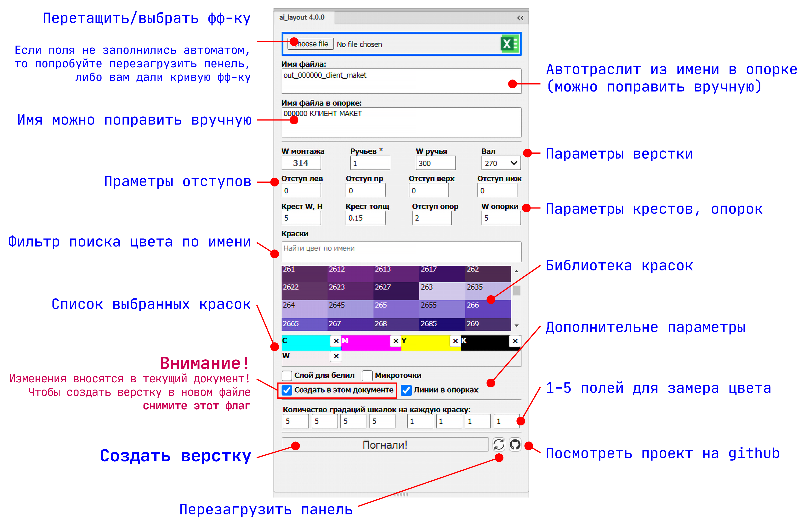

Интерфейс создания каркаса верстки выводного файла по стандарту ООО "Кастом Флекс"
===

ВНИМАНИЕ !
---
По умолчанию изменения вносятся в активный документ!
---
Чтобы создать верстку в новом файле нужно снять флаг `Создать в этом документе`
---

